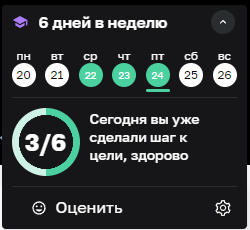

# Это сайт обо мне
## Я - студентка Нетологии

Привет! Я - студентка Нетологии, Александра. Курс QAMID-78. Здесь я расскажу о том, как скалдывается моя судьба на крусе, и как не потерять интерес к учёбе ;-)

## Разговор о себе
Мне 24 года. Я окончила институт культуры по специальности режиссёра театра, но работаю тестировщиком уже 2,5 года. Всё время мне казалось, что работа за компьютером - это скучно и нудно. Однако именно в этмо я нашла себя. К тому же, у меня достаточно творческая работа, что недалеко ушло от моей специальности:)

Сейчас остро чувствую потребность в повышении своих знаний, поэтому пришла на этот курс.
Знаю, что будет сложно, но я не боюсь трудностей, люблю двигаться вперёд, расти над собой. Можно сказать, что это удовлетворяет моё эго.
Это вопрос о здоровом эгоизме.

Представляю себя каким-нибудь лидом в команде естеров через пару лет. Хочу стать человеком, на которого равняются остальные, таким, чтобы можно было повести за собой, и чтобы люди хотели идти. Для этого нужно больше практики.

Ещё, я люблю путешествовать на поездах. Иногда это помогает отвлечься от суетных мыслей.
Из последеней поездки я привезла много хороших воспоминаний и эмоций.

## О тандеме с Нетологией
Наткнулась на этот курс я своершщенно случайно - в последний день набора учебной группы. Просто мне попалась реклама в мобильном браузере, и я решила посмотреть, так как несколько дней в голове у меня уже формировалась мысль о том, что нужно бы купить курс и проходить его.
Что я, собственно, и сделала - впрыгнула в последний вагон, если можно так выразиться.

Учитья я люблю. Сколько себя помню, мне легко даётся учиться - я усидчивая, терпеливая, и очень люблю новые знания. Однако, именно освоение этих знаний происходит не всегда так легко. Вот, например, блок с git. Пару раз пришлось пересматривать несколько лекционных видео, чтобы понять, что я делаю неправильно.

Мне нравится в Нетологии то, что у тебя нет шансов НЕ СДЕЛАТЬ домашнее задание. Иначе, не будет допуска к следующим блокам. Это честно со стороны создателей данного курса - так они дают реальные знания и отсеивают "лишних" людей, которые просто пришли на курс, потому что им сказали, что "надо".

Кстати, об этом. Если вы чувствуете, что хотите получить новые знания, но понимаете, что морально нет сил - лучше не стоит себя нагружать. Значит, всё-таки пока что не рвемя это делать. Нельзя заставлять себя, а тем более, чтобы кто-то вас заставлял - это абсурд. Будьте честны перед собой. Перегорели, нет желания - лучше вовремя отказаться, чем потом корить себя "зачем мне это было нужно, я столько времени потерял".

Ну, вернёмся к вопросам об обучении.
Для тех, кто всё-таки желает начать, дам несколько советов:
- продумайте, есть ли у вас средства оплатить обучение; не потянут ли расходы на обучение вас в финансовую яму;
- сколько времени вы будете готовы уделять обучению в неделю;
- сможете ли вы выполнять домашние задания в срок и соблюдать дедлайны;
- сможете ли вы работать по принципу "ученик-учитель", и работать с наставниками на курсе;
- в какое время дня вам было бы удобнее проходить обучение;
- сможете ли вы посещать онлайн-вебинары или только смотреть записи.

Это далеко не полный список, но для начала самый верный, на мой взгляд.
На своём опыте расскажу, что финансовый вопрос по обучению был решён почти что сразу: я взяла рассрочку, и теперь отдаю по частям. Это очень удобно. Так как всей суммы у меня не было. Но я понимаю, что это огроиное и хорошее вложение в моё будущее.
Касаемо занятий. Я поставила себе цель заниматься 5-6 дней в неделю по часу. Иногда получается больше времени уделять. И я занимаюсь по вечерам, так как днём работаю.

Важный совет от меня: старайтесь присутствовать на вебинарах онлайн. Это даёт возможность пообщаться с преподавателем, задать вопросы, посмотреть практические материалы, услышать подсказки от педагогов. А также хорошим кейсом будет посещение воркшопов.

Главное - не бойтесь задавать вопросы. Это не плохо, за это вас никто не осудит. Хуже, когда вопросов вообще нет. Не бойтесь возвращаться к старым материалам курса, пересматривать, перечитывать. В этом нет ничего зазорного - пусть с пятой попытки, но запомните нужную информацию. Каждому нужен свой темп работы и обучения.

## Если вам понравился спич
Если вы вдохновились или вам просто понравился мой слог, то вы можете найти меня на разных площадках:

[Грустнограм](https://grustnogram.ru/u/alexa5728)

[ВКонтакте](https://vk.com/alexa5728)

А если вам понравился мой рассказ о себе, то вы можете найти моё резюме здесь:
[hh](https://orel.hh.ru/resume/21fce8e9ff08e99d480039ed1f3634764e6e73)